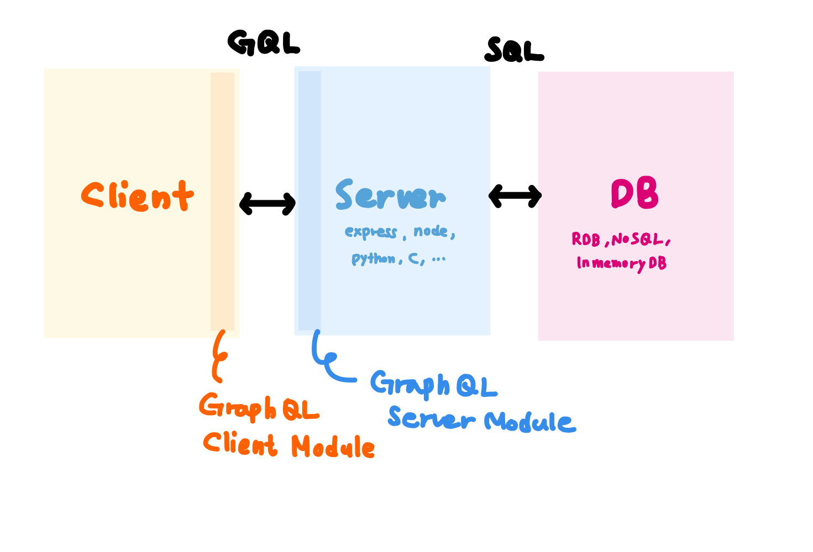
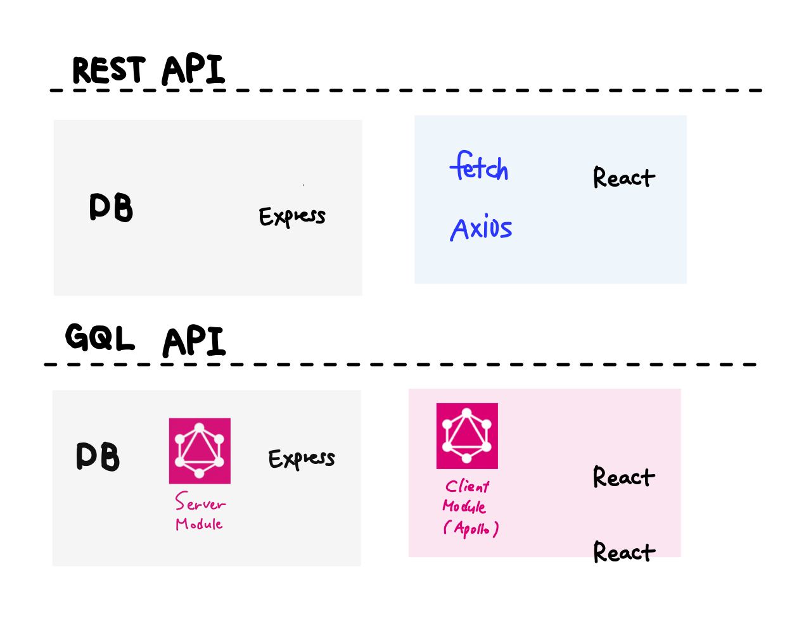

<br>

이 문서는 [노마드코더의 graphQL로 영화API만들기](https://nomadcoders.co/graphql-for-beginners/lobby)코스를 들으며 배운 내용을 정리한 문서입니다.<br>

<br>

## 시작하며

github이 사용하는 기술로도 유명한 graphQL 은 Server Driven UI에 대해 조사하다가 알게 되었습니다. <br>
일반 ts 가 아닌 코드가 있길래 찾아보니 graphQL의 스키마 정의 코드였습니다. <br>
GraphQL을 사용하면 서버와 클라이언트가 같은 스키마를 공유할 수 있기에 좋은 선택지라 하더라구요. <br>
적용되기 시작한지 얼마 되지 않은 기술이지만 많은 인기를 얻고 있다기에 한번 가볍게 공부해보고 싶었습니다. <br>

<br>

## ？ GraphQL

### 1. SQL과 마찬가지로 쿼리 언어이지만 사용방식과 구조의 차이가 큽니다.

<br>



<br>

> [!NOTE] SQL과 GQL의 차이
>
> 1. SQL은 DB 시스템에 저장된 데이터를 효율적으로 가져오는 것이 목적인 반면
> 2. GQL은 웹 클라이언트가 데이터를 서버로부터 효율적으로 가져오는 것이 목적입니다.
> 3. GQL은 주로 클라이언트 시스템에서 작성하고 호출합니다.

<br>

### 2. GraphQL을 사용한 백엔드의 API 구조(GQL API)는 REST API와 비교할 수 있습니다.

<br>



<br>

> [!NOTE] REST API와 GQL API의 차이
>
> 1. REST API가 URL, METHOD를 조합하여 다양한 Endpoint를 사용하는 반면
> 2. GQL은 단 하나의 Endpoint가 존재합니다.
> 3. REST API에서는 Endpoint 마다 데이터베이스 SQL 쿼리가 달라지는 반면
> 4. GQL API 는 GQL 스키마 타입마다 데이터베이스 SQL 쿼리가 달라집니다.
>
> 하나의 엔드포인트로 여러가지 요청을 해결할 수 있고 한번의 네트워크 호출로 처리할 수 있습니다.

<br>

## GraphQL API을 사용해야 하는 이유

REST API가 있음에도 불구하고 왜 쿼리 형식의 GraphQL API가 등장하게 되었는지, 그 이점이 무엇인지 알아봅니다.

### ？ API

**A**pplication 어플리케이션 **P**rogramming 프로그램 **I**nterface 상호작용

- 어플리케이션과 상호작용하기 위한 프로그래밍 도구
- API는 명령어(command)를 실행하는 버튼

<br>

### ？ REST API

리소스나 리소스의 목록을 얻기 위해 아래의 방식을 조합하여 REST API를 작성합니다

- **URL** _includes query → 명사_
- **HTTP METHOD** (GET, POST, PUT, PATCH, DELETE ..) _→ 동사_

<br>

### REST API 대신 GraphQL API 가 사용되는 이유

- [GraphQL 명세링크](https://github.com/graphql/graphql-spec)
- **over-fetching 문제를 해결할 수 있습니다**

  > **Ask for what you need, get exactly that**
  >
  > Send a GraphQL query to your API and get exactly what you need, nothing more and nothing less. GraphQL queries always return predictable results. Apps using GraphQL are fast and stable because they control the data they get, not the server.

  - over-fetching이란 필요한 데이터만 가져오는 것이 아니라 모든 데이터를 가져오는 것을 이야기합니다
  - graphQL은 필요한 데이터 이상을 받아오는 것을 막을 수 있습니다
  - graphQL은 url을 통해 data를 요청을 하지 않고 필요한 data 만을 요청합니다.

  <br>

  요청 _request_ 형식과 응답 _response_ 형식의 비교

  ```graphql
  //요청
  {
  	hero {
  		name
  		height
  	}
  }
  ```

  ```graphql
  //응답
  {
  	"hero": {
  		"name": "zzinLee",
  		"height": 180
  	}
  }
  ```

<br>

- **under-fetching 문제를 해결할 수 있습니다.**

  > **Get many resources in a single request**
  >
  > GraphQL queries access not just the properties of one resource but also smoothly follow references between them. While typical REST APIs require loading from multiple URLs, GraphQL APIs get all the data your app needs in a single request. Apps using GraphQL can be quick even on slow mobile network connections.

  - 필요한 데이터보다 덜 받는 현상을 under-fetching 이라 합니다.
  - 한 화면에 보여줘야 하는 데이터가 서로 다른 url 에 있다면 하나의 url로는 정보가 부족하고 _under-fetching_ 또 다른 url에 필요한 데이터를 요청해야 할 수도 있습니다. 이 경우 불필요한 데이터를 많이 가져오는 문제 _over-fetching_ 를 다시 한번 야기하게 됩니다.

<br>
<br>

### Reference

- [카카오tech-GraphQL 개념잡기](https://tech.kakao.com/posts/364)
