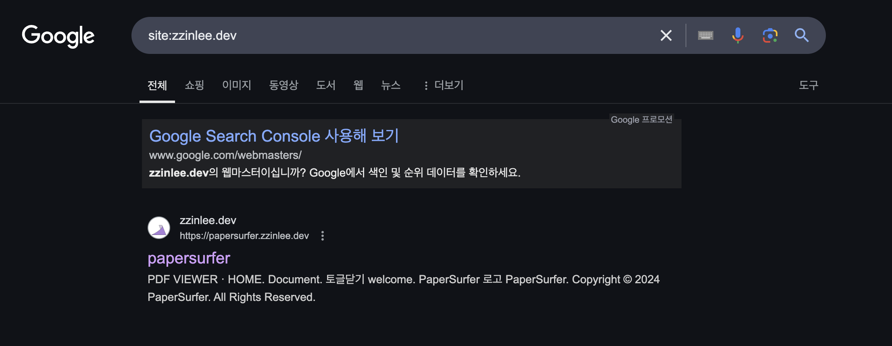
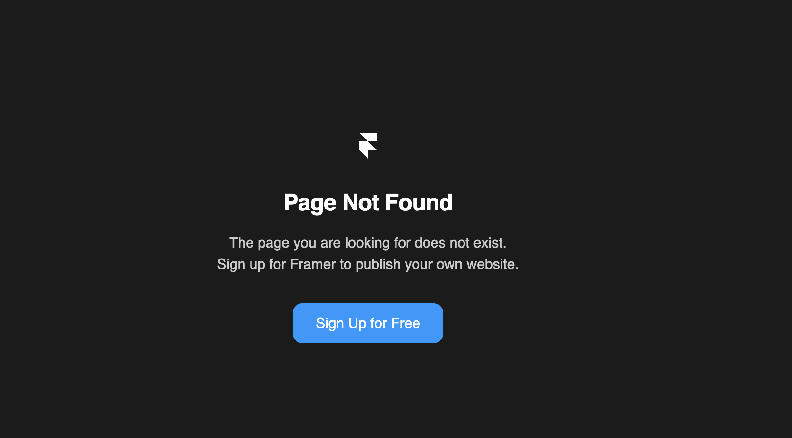

# 위험한 사이트 경고

멀쩡히 잘 운영되던 웹사이트에서도 chrome 접근 시 '안전하지 않은 사이트 경고'가 발생할 수 있었다.  
내가 관리할 수 있는 사이트는 서브 도메인 사이트였고, 이 사이트에서 경고가 발생했다.  
robots.txt 추가를 통해 크롤링에 대한 대비를 해두면 억울하게 사이트가 문제되는 일은 없을 것이라는 이야기를 듣고 이를 작성하고 있었다. 
 
작성 도중, 우리 사이트는 `/login` 경로를 제외한 나머지 페이지에서는 토큰 없이는 접근이 불가능하고,  
따라서 웬만하면 크롤러에 의해 문제가 발견될 일이 없을 것이라는 생각이 들었다.  
이에 대해 검색하던 도중 서브 도메인 사이트는 루트 도메인이 문제가 있다면 막힐 수 있다는 걸 알게 되었다.  
따라서 루트 도메인 사이트에 대해 확인을 하는 것이 우선시 되었다.  

- [WEB DEV 해킹 당한 것 같아요](https://web.dev/articles/hacked?hl=ko)

안내에 따라 찾아가보니, `site:[루트 도메인]` 검색을 통해 해커가 추가 했을 수도 있는 페이지를 포함한 모든 페이지가 표시된다고 한다.
 
Google Search Console 을 통해 상세한 '죄목'을 확인할 수 있기는 한데,  
우리의 경우 특정 URL에서 문제가 발생하고 있다고 표기되어 있었고, 해당 URL은 비워져 있어서 문제가 되는 URL을 확인하기 어려웠다.  

 

검색 예시는 아래의 이미지와 같다.  

 

검색을 통해 도메인으로 접근할 수 있는 여러 개의 사이트를 뒤져 보았을 때, 다음과 같은 동작들이 문제 삼아진 것으로 의심할 수 있었다.

1. 전화번호 입력 폼 제공
2. 특정 URL에서 앱 스토어로 리다이렉트 하는 사이트(/Deep link)
3. 예측하지 못한 잘못된 URL 접근 시 직접 만든 404 에러 페이지 대신 Framer라는 사이트의 Page Not Found 로 리다이렉트

우선 1번, 전화번호 입력의 경우 목적이 불분명한 경우 문제가 발생할 수 있다고 되어 있으나, 우리 사이트에는 목적이 명시되어 있으므로 이 경우는 아닐 것으로 판단했다.  
다음 2번, 앱스토어 강제 리다이렉트의 경우,  
리다이렉트 중이라는 표기가 잘 명시되어 있거나 앱스토어로 이동이라는 버튼이 잘 명시되어 있다면 문제가 없다고 했으므로 이 경우 역시 아닐 것으로 판단했다.  
따라서 문제가 있었다면 마지막 3번의 경우일 것으로 판단이 된다.

 

우리가 소유한 도메인에서 접근 가능한 URL에서 `[루트 도메인 URL]/null`와 같이 404 Not Found Error가 발생하는 경우, Framer의 404 에러페이지가 렌더되는 문제가 있었다.  
아마 의도된 동작은 아닐 것이다. 저 버튼을 누르면 엉뚱하게 Framer의 가입사이트로 이동하게 된다.

 

 

하지만, 루트 도메인은 내가 배포한 사이트가 아니었고 해당 프로젝트 레포지토리 권한이나 도메인 사이트 권한이 없어 이 이상 확인할 수 없었다.  
몇 가지 사이트를 통해 확인할 수 있는 정도까지만 확인해보았다.

- https://httpstatus.io/ (리다이렉트 흐름을 볼 수 있는 사이트)
- https://dnschecker.org/ (DNS 설정을 확인할 수 있는 사이트)

Framer 서버를 사용하고 있는 것 같기는 하다.
프로젝트 404 에러 페이지 연결 시 잘못된 리다이렉션을 하고 있는 것 같은데,  
도메인은 변경되지 않는 것으로 보아서 배포 시 CNAME, A 레코드 설정이 Framer로 연결 되었을 확률이 있다고 생각했다(맞는지 모르겠다).  
우선 프로젝트 redirects 설정을 확인해야 할 것 같고, 프록시 설정 및 HTTPS 인증서를 확인해야 할 것 같다.  

이 문제가 해결되면 그 동안 미뤄왔던 배포와 관련한 포스팅을 해야할 것 같다.

 
